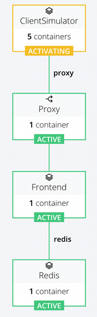

# Docker Training Exercise

## What is Docker

Docker is currently leading the charge in containers. Want to know more check with Docker themselves: [https://www.docker.com/whatisdocker](https://www.docker.com/whatisdocker)

## Docker toolsets

[Docker Engine](https://www.docker.com/docker-engine) is the the core of docker, providing the runtime for building and running containers. It provides a REST API as well as a CLI.

[Docker Machine](https://www.docker.com/docker-machine) is a tool to create docker hosts and inject the docker engine into them. It works with almost all major cloud providers (AWS, Google, Azure, DigitalOcean and many more) and can create host docker VM's on your local machine too.

[Docker Compose](https://www.docker.com/docker-compose) creates a layer of abstraction above the docker API to create and manager multi container applications with additional tools for scaling.

[Docker Swarm](https://www.docker.com/docker-swarm) can create scale out docker hosts while allowing you to interact with the docker engine API as if it was a single host.

[Docker Registry](https://www.docker.com/docker-registry) is basically like git for docker contianers. It stores images (the base of a contianer before it's instantiated) in a central repository.

## What we'll be looking at

We'll be going through an example of how we can use docker to build a simple scalable web application.

We'll use:
  - docker engine
  - docker machine
  - docker compose

## Pre-requisites 
Install Homebrew if you don't already have it
```
ruby -e "$(curl -fsSL https://raw.githubusercontent.com/Homebrew/install/master/install)"
```
Install the below packages (or at least the ones you don't already have)
```
brew install git
brew install node
brew install docker
brew cask install docker-machine
sudo pip install pyopenssl ndg-httpsclient pyasn1 docker-compose
```

# Setup a Docker Host

##Create a new docker host VM
Use either virtualbox:
```
docker-machine create --driver virtualbox --virtualbox-cpu-count 4 --virtualbox-memory "2048"  --virtualbox-disk-size "5000" dev-host
eval "$(docker-machine env dev-host)"
```
Or VMWare Fusion if you have it installed:
```
docker-machine create --driver vmwarefusion --vmwarefusion-cpu-count "4" --vmwarefusion-memory-size "2048"  --vmwarefusion-disk-size "5000" fusion-docker
eval "$(docker-machine env fusion-docker)"

```
You can access the machines directly via IP (```docker-machine ip dev-host```) or add a host to your hosts file:

```
echo `docker-machine ip dev-host` dev-host >> /etc/hosts
```

# Instructions

Pull this repo locally
```
git clone http://git.servian.com/adam.parker/dockertraining.git DockerTraining
```
Check that docker is running

```
docker ps
# Should return
CONTAINER ID        IMAGE                             COMMAND                CREATED             STATUS              PORTS                              NAMES
```

The applications structure looks a bit like this:
 - [Node client simulator](Frontend/Dockerfile)
 - [Reverse proxy server](Proxy/Dockerfile)
 - [Node web application](Frontend/Dockerfile)
 - [Redis](Redis/Dockerfile)

 
 
## Building
Once you've taken a look at each of the docker files above, we need to build each of them into an image.

The docker command to build an image from a dockerfile in the same directory is:
```
docker build .
```
To build each image in the project from the root directory including a tag name (```-t name```) this would be:
```
docker build -t base Base/
docker build -t frontend FrontEnd/
docker build -t redis Redis/
docker build -t proxy Proxy/
```
To shorten builds you can stick this in a file like [rebuild.sh](rebuild.sh) and call it:
```
./rebuild.sh
```
Building the images will normally require an internet connection. If docker cannot reach the internet the build will fail if any of the images install packages using the package manager, pull git repos or use curl to download packages.

## Running
Running containers manually can be done via the ```docker run``` command. For example to run the Redis server try:
```
docker run redis
```
You'll notice that you automatically ssh into the machine and see its logs when you do this. Running a container in 'detatched' mode allows you to run the container in the background without user interaction.
```
docker run -d redis
```
Try listing the containers now:
```
docker ps
#should show you:
CONTAINER ID        IMAGE                             COMMAND                CREATED             STATUS              PORTS                                          NAMES
6c0b1897e0aa        redis:latest                      "redis-server"         30 minutes ago      Up 30 minutes       6379/tcp                                       random_name
```
To shutdown this container you'll need to use its name or its ID from the above command, for example:
```
docker kill 6c0b1897e0aa
```

Using the docker CLI to run a multi container application can be quite complex, for example running all the containers in this app would be:
```
docker run -d --name redis redis
docker run -d --link redis:redis --name frontend frontend
docker run -d --link frontend:frontend -p 80:80 --name proxy proxy
```

Test the application by going to the ip of the docker machine in your browser
```
docker-machine ip dev-host
```
The number should increment by 1 with each refresh.

Now start the client simulator
```
docker run -d -e "ENABLED=1" --link proxy:proxy --name viewer frontend node viewer.js
```
Refresh the screen in your browser again and you should see the number increasing much faster as the client simulator hits the same url.

Now to kill off these containers and free up their names so they can be used again run the below commands:
```
docker kill redis
docker kill frontend
docker kill proxy
docker kill viewer
docker rm redis
docker rm frontend
docker rm proxy
docker rm viewer
```

While this is relatively simple for our application, when it comes to starting up more complex ups with many containers with dependencies and links between them it starts to get complex.

## Composing
The steps above can be simplified by using docker compose.

Now lets take a look at the [docker-compose.yml](docker-compose.yml) file. This defines the containers that will make up the app and the dependencies between them.

The steps we used above to launch the containers can now be down using:
```
docker-compose up -d
```
Which creates the containers in the correct order based on the links defined in the yaml file.

Test the application via the browser again. It should be increment by 1 for each refresh. To enable the viewer edit the docker-compose.yml file locally and changed the ENABLED environment variable for the viewer container to 1.

Now run the same command again to recreate the containers:
```
docker-compose up -d
```
This time the viewer should be running and incrementing the count faster.


## Scaling
Firstly lets scale the number of viewer containers out to 10
```
docker-compose scale viewer=10
```
Goto the URL 'host_name/counters'

This will show you the number of hits by the requesting IP address. There should be 11 addresses there now, one of them being yours and the other 10 being the client simulators (viewer container).

Now lets scale out the frontend:
```
docker-compose scale frontend=5
```
We'll need to shutdown the app to change the proxy config.
```
docker-compose kill
```
The file is in Proxy/haproxy/haproxy.cfg
Uncomment the following lines in the round robin config:
```
server frontend_2 frontend_2:80 check
server frontend_3 frontend_3:80 check
server frontend_4 frontend_4:80 check
server frontend_5 frontend_5:80 check
```
You'll need to rebuild the proxy containers image:
```
./rebuild.sh
```
Now start up the app again:
```
docker-compose up -d
```

This time go to port 70 in your browser and you can see how the proxy is redirecting the hits to each frontend server but if we go the the original URL we can see the count going up in a uniform manner because the frontend servers don't hold the source of truth for the counter, this is still in the single redis container.

This structure allows you to scale out application logic almost infinitely to accomodate more hits.

